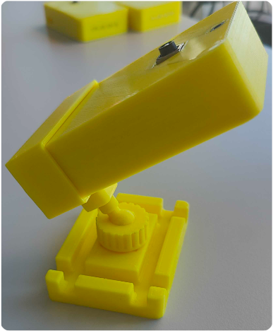
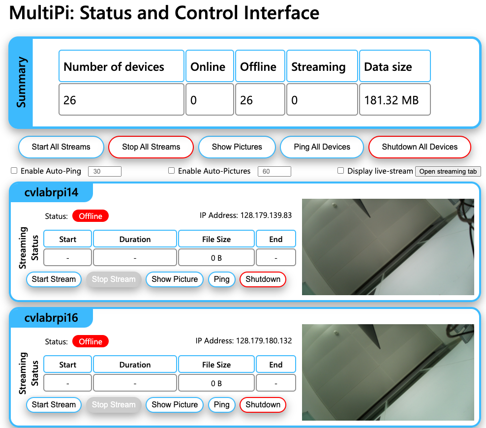

<div align="center">
  
</div>

<div align="center">
  <h1>Synchronized Multi-Camera Video Acquisition</h1>
</div>


[](https://opensource.org/licenses/MIT)

MultiPi is a flexible video acquisition pipeline designed for academic research, enabling synchronized recording from multiple cameras (clients) to a central server. Initially built for Raspberry Pi camera modules, it can be adapted for other Linux-based camera systems.

It simplifies multi-camera setups by handling remote control, monitoring, centralized data storage (reducing client storage needs), and time synchronization across video streams. For unreliable network conditions, clients can optionally cache data locally and upload it later.


<div align="center">
  
  &nbsp;&nbsp;&nbsp;&nbsp;&nbsp;&nbsp;&nbsp;
  
  &nbsp;&nbsp;&nbsp;&nbsp;&nbsp;&nbsp;&nbsp;
  
</div>


## Key Features

*   **Multi-Client Architecture:** Connect and manage numerous cameras from a central point.
*   **Synchronized Recording:** Ensures temporal alignment across video streams from different clients.
*   **Centralized Storage:** Streams video data directly to the server for storage.
*   **Remote Control & Monitoring:** Start, stop, and monitor recordings via a web interface.
*   **Flexible Configuration:** Customize acquisition parameters via configuration files.
*   **Offline Caching (Optional):** Clients can store data locally if network connectivity is intermittent.
*   **Raspberry Pi Optimized:** Includes specific setup instructions and optimizations for Raspberry Pi. 
See also the [3D Printable Case & Mount](./raspberry-pi-setup/3d_files/README.md).

## Prerequisites

*   **Python:** Python 3.x
*   **FFmpeg:** Required on the server for video processing. ([Installation Guide](https://ffmpeg.org/download.html))
*   **MQTT:** Required on the server for communication between clients and server. ([Installation Guide](https://www.eclipse.org/paho/clients/python/))
*   **Network:** All server and client machines must be on the same network.
*   **Operating System:** Only tested on Linux. 

## Installation

We recommend using a Python virtual environment (e.g., `venv`) for installation.

```bash
# 1. Clone the repository
git clone https://github.com/M-Eng/multipi.git
cd multipi

# 2. Create and activate a virtual environment (example using venv)
python3 -m venv venv
source venv/bin/activate 

# 3. Install core dependencies (including server and client)
pip install -r src/server/requirements.txt
pip install -r src/client/requirements.txt
```

*   For detailed **Server Setup**, see: [`docs/SERVER_README.md`](./docs/SERVER_README.md)
*   For detailed **Client Setup**, see: [`docs/CLIENT_README.md`](./docs/CLIENT_README.md)
*   For specific **Raspberry Pi Setup**, see: [`docs/RPI_README.md`](./docs/RPI_README.md)

## Getting Started: Quick Start

1.  **Configure:** Modify configuration files in `configs/` as needed (e.g., server IP address, camera settings). See [Configuration](#configuration) below.
2.  **Start the Server:**
    ```bash
    python3 src/server/start.py
    ```
3.  **Start a Client:**
    ```bash
    python3 src/client/connect.py
    ```
4.  **Access Web Interface:** Open your web browser and navigate to `http://<server_ip>:5000`. You should see connected clients.
    <!-- Placeholder: Add a screenshot of the web interface from images/ ? -->
5.  **Control Recording:** Use the web interface to start/stop recording on clients. Data will be saved on the server (default location specified in the configuration file `VIDEO_DATA_DIR`).

## Usage

Refer to the Quick Start guide above for basic operation.

*   **Web Interface:** Provides monitoring and control for connected clients.
*   **Command Line:** Server and clients are started via the command line as shown above.
*   **Auto-Start:** For Raspberry Pi clients, refer to the [RPi Setup Guide](./docs/RPI_README.md) for instructions on automatic startup on boot.

## Configuration

System behavior is customized through configuration files located in the `configs/` directory:

#### Server Configuration ([`config_server.ini`](./configs/config_server.example.ini))
- MQTT Settings: Configure broker address, port, and certificate paths for secure communication
- Webserver Settings: Set server address, port, and authentication credentials
- Main Settings: Define video data storage directory

#### Client Configuration ([`config_client.ini`](./configs/config_client.example.ini))
- MQTT Settings: Configure broker address, port, certificate paths, and reconnection parameters
- Stream Settings: Set server address for video streaming
- Main Settings: Additional client-specific parameters

For detailed configuration options, refer to the example files in the `configs/` directory.

## Documentation

*   **Server Details:** [`docs/SERVER_README.md`](./docs/SERVER_README.md)
*   **Client Details:** [`docs/CLIENT_README.md`](./docs/CLIENT_README.md)
*   **Raspberry Pi:** [`docs/RPI_README.md`](./docs/RPI_README.md)


## Contributing

Contributions are welcome! Please read our [Contributing Guidelines](./CONTRIBUTING.md)


## License

This project is licensed under the MIT License - see the [LICENSE](./LICENSE) file for details.

## Support & Contact

If you found this project useful, please consider citing it as follows:

```bibtex
@misc{multipi,
    author = {Engilberge, Martin},
    title = {MultiPi: Synchronized Multi-Camera Video Acquisition},
    url = {https://github.com/M-Eng/multipi},
    year = {2025},
}
```

