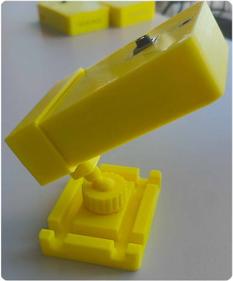

# MultiPi Raspberry Pi Case and Mounting Bracket

This directory contains 3D model files for printing a protective case for a Raspberry Pi 4 and Camera Module 3, along with a mounting bracket.

These files are designed to be 3D printed. Standard PLA or PETG filament should work well.

## Files

*   **Case:**
    *   `case/rpi_case_bottom.stl`: The bottom part of the Raspberry Pi case.
    *   `case/rpi_case_front_with_button.stl`: The front part of the case, designed to accommodate a button (optional).
    *   `case/rpi_casefront.stl`: Alternative front part of the case (without button cutout).
    *   `case/camera_bracket_v3.stl`: Internal bracket to hold the Camera Module 3 inside the case.
*   **Mounting Bracket:**
    *   `mounting_bracket/rpi_mounting_bracket.3mf`: A bracket to easily mount the assembled case.

## Assembly and Preview

Below are images showing the case components and the assembled unit with the mounting bracket.

  
  &nbsp;&nbsp;&nbsp;&nbsp;&nbsp;&nbsp;&nbsp;&nbsp;&nbsp;&nbsp;&nbsp;&nbsp;
  
  
<em>Case Animation and Assembled case with Camera Module 3 and mounting bracket</em>

 

  
  &nbsp;&nbsp;&nbsp;&nbsp;
  
  
<em>CAD views of the mounting bracket</em>

## Printing Recommendations

*   **Material:** PLA, PETG, or similar.
*   **Layer Height:** 0.2mm recommended for a balance of speed and detail.
*   **Supports:** May be needed depending on your printer and the orientation of the parts (especially for overhangs on the case parts).
*   **Infill:** 15-25% should be sufficient. 